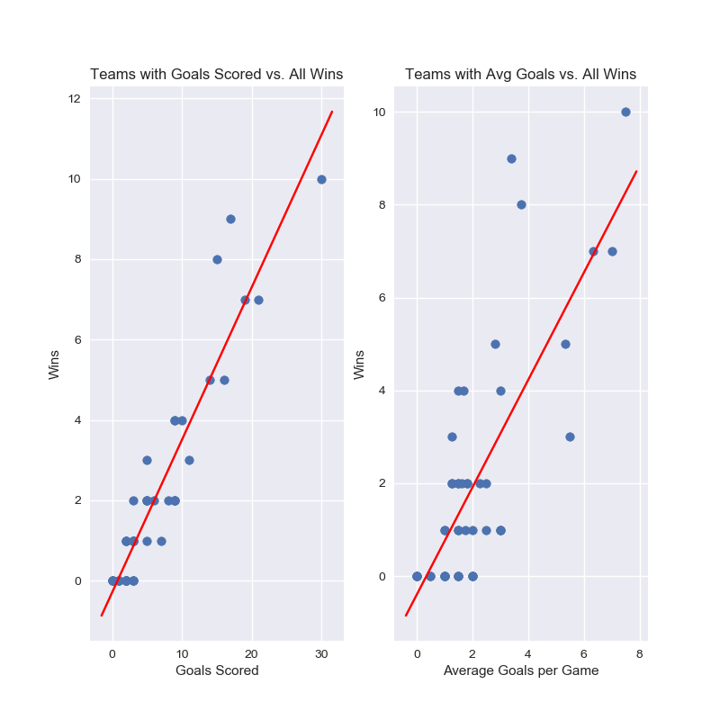
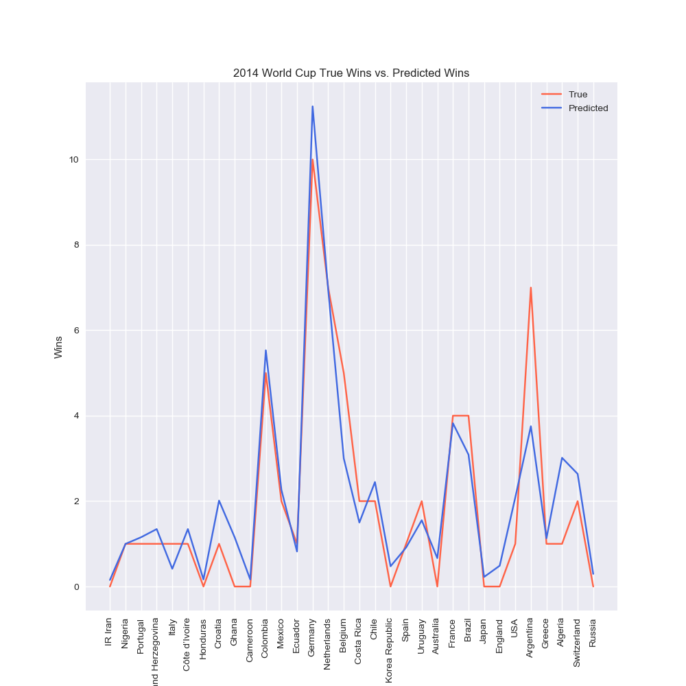

# Capstone 1 - FIFA World Cup Analytics
## Troy Kayne

### Summary

I decided to explore data of every World Cup since 1930. Initially, this dataset seems very promising because it had two large datasets of matches and players with a total of 40,000 rows. That seems like a lot data where I can find some common trends. Although, the players table did not give me anything relevant for determining how good a team is that year. So, I basically excluded that dataset and stuck with the cups and matches dataset. From there, I had to perform a lot of data manipulation to clean up my data so I could conduct a LinearRegression model. My model trained data from two World Cups, 2006 and 2010. I used that model to predict the number of wins a team would get in the World Cup of 2014.

### Question
Based off the data from 2006 and 2010, which two teams will be predicted in the World Cup championship of 2014? Who will win it all?

Source: <a>https://www.kaggle.com/abecklas/fifa-world-cup#WorldCupPlayers.csv</a>

### EDA

I began cleaning up my data by replacing Country Team names that are difficult to work with. For example, Germany FR and Germany were two different values under Country name. I figured I could just combine them into one name as Germany.

 To get a solid understanding of the dominant countries in the world cup, I stacked each win for every country that won the World Cup.

#### Winners from all world cups

As you can see, Brazil has the most World Cup championships of 5 wins in years 1958, 1962, 1970, 1994, and 2002. Runners up are tied with 4 wins, Italy and Germany. Germany won in 2014, which is the year I am testing my model with.

Next, I created a cleaned up csv file of the matches dataset with Pandas. I added a new column that shows the winner of each match. I tallied up every time a Country played as home and away in order to calculate the total matches. Then, I manipulated the data with a new dataframe of each team and their total stats which contain number of wins, number of goals scored, number of goals scored against, total matches, average goal count per game, number of losses, etc.

Before, my data columns looked like this.

After data manipulation, I transformed the columns to look like this.

These results would make a good representation for my features of a Linear Regression model. I splitted the data in 2 sets where one represents years 2006 and 2010 and the other represents only 2014.

Some of these features had strong linear relationships with number of wins. Here are a couple examples in years 2006 and 2010.

Each dot lies a team and their fit for Goals Scored and Avg Goals versus All Wins. Then in the World Cup of 2014, I got the following stats for the same features.

Here, I'm dealing with 64 matches in 2014 instead of 128 you can see in the previous image.

Target Value: Number of Wins

Features:
- All Goals Scored
- Avg Goals Scored Per Game
- Goals Against
- Total Matches
- Draws

After combining these correlating features with all wins, I trained a Linear Regression model with years 2006 and 2010 in order to predict the number of wins for each team in 2014. Here is plot that shows my predictions and the true values of number of wins.

My predictions are very similar with the true number of wins. The two lines are very close.

R2 score: 0.8516  
Ridge Model MSE: 0.669  <!-- Maybe not include this?-->

Based off these predictions, I would take the two tallest values as the teams who make it to the 2014 World Cup championship, which appears to be Germany and Netherlands with Germany winning it all(Blue line). In reality, the two teams in the championship was Germany and Argentina, but Germany did win it all! Argentina was not too far off in my predictions, however. They tied with Netherlands with a number of 7 wins. In conclusion, it looks like my prediction correctly guessed that Germany would take home the World Cup in 2014.
